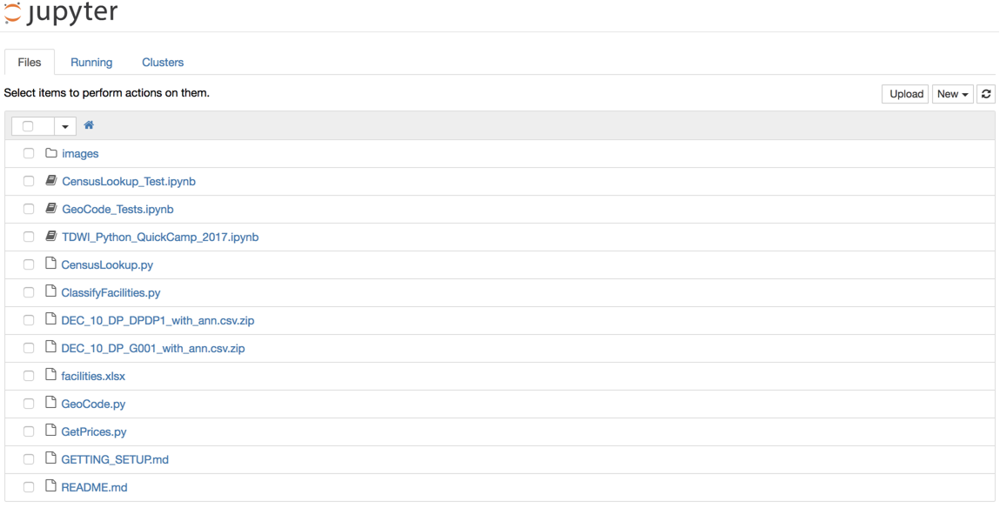

# Introduction
This document takes you through the general steps of setting up your environment to run through the Python Quick Camp.  If you run into trouble, searching your error message in Google should help.

At a high level, you'll need the following setup and running on your computer.

1. [Python 3.x](#python-3.x)
2. [The pip Python package manager](#pip-package-manager)
3. [Python Libraries](#python-libraries)
    * *jupyter* - The web-based, interactive Python notebook
    * *pandas* - Data manipulation based on dataframe structures
    * *seaborn* - Create plots and charts for visualization
    * *nltk* - Natural language processing (NLP) algorithms and content
    * *sklearn* - Machine learning algorithms like k-means clustering
    * *BeautifulSoup* - Library to parse HTML documents for web scraping
    * *plotly* - Access to Plot.ly web service and plotting library
4. [Google Geocoding API Key](#google-geocoding)
5. [Plotly account and API Key](#plotly)
6. [Downloaded data from US Census](#us-census-data) [included in GitHub]
    * "Profile of General Population and Housing Characteristics: 2010"
    * DEC_10_DP_G001_with_ann.csv
    * DEC_10_DP_DPDP1_with_ann.csv
7. [Downloading this Repository](#downloading-this-repository)
8. [Getting Jupyter Started](#getting-jupyter-started)

# Python 3.x
There are two different versions of Python being actively maintained.  For this course, you'll be using Python 3.x and should install it for complete compatibility.  You can find more information about what's going on with Python 2.x and Python 3.x on the official [Python 2 or Python 3 wiki page](https://wiki.python.org/moin/Python2orPython3)

The easiest way to install Python for many people is via Anaconda.  You can find instructions for installing Python 3.x and Jupyter on the [installing jupyter notebook page](http://jupyter.readthedocs.io/en/latest/install.html).

On that same page, there are also instructions for [installing Python and Jupyter if you're an experienced Python user](http://jupyter.readthedocs.io/en/latest/install.html#alternative-for-experienced-python-users-installing-jupyter-with-pip).

In the final section of this setup document, [Getting Jupyter Started](#getting-jupyter-started), you'll get Python up and running.

# PIP Package Manager
PIP is a utility for installing and upgrading extra Python libraries.  By default, Python comes with a huge standard set of libraries, but most of the ones we'll use for data manipulation and graphing will need to be installed separately.

The [official instructions for installing pip](https://pip.pypa.io/en/stable/installing/) should get everything setup for you.  If you installed Python via Anaconda, then you will use the `conda` package manager instead.  It is installed by default.

# Python Libraries
Once you have `pip` or `conda` installed, you'll need to install the packages that will be required for this course.  You can get them all in one command.

If you only have Python 3.x installed on your system:
> `pip install jupyter pandas seaborn nltk sklearn BeautifulSoup plotly`

If you have Python 2.x and 3.x both installed, you may need to specify the 3.x version of `pip`:
> `pip3 install jupyter pandas seaborn nltk sklearn BeautifulSoup plotly`

If you installed Python via Anaconda:
> `conda install jupyter pandas seaborn nltk sklearn BeautifulSoup plotly`

# Google Geocoding
One of the steps in this course will include using the Google Maps Geocoding API to lookup the ZIP code based on address.  The class will include an API key that you can use short-term, but I recommend that you get your own Google API key so that you can continue to use the service after the class is over.

Sign in using a Google account and follow just **Step 1** from the official instructions for [Getting an API Key](https://developers.google.com/maps/documentation/geocoding/get-api-key)

Keep track of your API key so that you can use it during class.

# Plotly
Python has several built-in libraries that are excellent for plotting graphics including matplotlib, pandas, and seaborn.  All of these create mainly static images.  The Ployly library and corresponding web services create web-based graphics that provide interactive zoom, tool tips, and filters.  To use Plotly, you need to create an account at [ploy.ly](https://plot.ly/) and generate a key from the [API Settings](https://plot.ly/settings/api) page.

This key needs to be setup in the right place on your local machine by following [the official instructions from Plotly](https://plot.ly/python/getting-started/#initialization-for-online-plotting).  The command you'll need to run will look something like:

> `plotly.tools.set_credentials_file(username='myName', api_key='myAPIKJey')`

# US Census Data
Doing research with data often requires merging together internal and external information.  In this class, we're bringing in additional data from the US Census, namely demographic information by ZIP code.  The required data files are already part of this repository, so you do not need to download them.

For reference, however, the data being used is called "Profile of General Population and Housing Characteristics: 2010".  In this repository, this is the `DEC_10_DP_DPDP1_with_ann.csv.zip` file.

# Downloading this Repository
You don't necessarily need a GitHub.com account to download a copy of this repository, but it may be helpful to have for other projects if you don't have one already.  Visit https://github.com/join to setup an account, if you like.

## Option A: If you have a github.com account
Using a git client or the git command line, you can find this repository at git@github.com:paulboal/tdwi-accelerate-2017-python.git.  This will create a new directory called `tdwi-accelerate-2017-python`.

> `git clone git@github.com:paulboal/tdwi-accelerate-2017-python.git`

## Option B: Without a github.com account
If you don't have a GitHub.com account or a git client application, you can also download the contents of this repository using the url below.  Save this file to your machine and uncompress it.  You should end up with a directory called `tdwi-accelerate-2017-python`.

> https://github.com/paulboal/tdwi-accelerate-2017-python/archive/master.zip

Consider putting this folder in your Home directory or under _Documents_ on Windows.  Note where this directory is on your machine.  You'll need to know that location in order to start up the Jupyter web notebook correctly.

# Getting Jupyter Started
The Jupyter web notebook can be run on a centralized server for multiple users (Jupyter Hub) or run on an individual's personal machine.  If you're just trying something out, you may be able to using an online service that provides Jupyter access, such as https://try.jupyter.org/.  

For this course, you're expected to follow the setup instructions in this document and run the Jupyter notebook locally.

To start Jupyter running locally for this course, you'll want to launch Jupyter while in the repository directory you downloaded in the [previous step](#downloading-this-repository).

## On Linux or MacOS
1. Launch a terminal
2. `cd <where you downloaded the repository>` for example: `cd /Users/myname/Documents/tdwi-accelerate-2017-python`
3. `jupyter notebook`

## On Windows
1. Launch Anaconda Prompt from the Start menu
2. `cd <where you downloaded the repository>` for example: `cd C:\Users\myname\Documents\tdwi-accelerate-2017-python`
3. `jupyter notebook`

## On Windows with Anaconda
If you've installed Anaconda on Windows, you'll have a Start Menu icon to launch Jupyter directly.  This will work fine if you saved the GitHub repository to a directory somewhere within your Home directory.  By default Anaconda launches Jupyter from your Home directory, so you'll see things like _Documents_, _Downloads_, etc.  Just click the folder to navigate to where the repository is.

When Jupyter launches, it should automatically launch your web browswer as well, and pull up a page that looks like the screenshot below.

To get you oriented a little bit, here is a basic description of the files you'll see:

| File Name                   | Description
|-----------------------------|-------------------------------------------
| TDWI_Python_QuickCamp_2017  | The main file for this course.  There are other project libraries specific to this course (the .py files), but the main thread of work and analysis happens in the TDWI Python QuickCamp 2017 notebook.
| *_Test                      | These are notebooks with some simple test code to demonstrate how some of the more complex project libraries work.
| *.py                        | There is a lot of code for this course encapsulated within project libraries.  These files contain helper code that keeps the main thread of our analysis work less cluttered.
| *.csv.zip                   | These are the pre-downloaded data files from the US Census.
| *.md                        | Readme and instructions you need for getting started.

Open the [TDWI Python QuickCamp 2017 notebook](TDWI_Python_QuickCamp_2017.ipynb) and let's get started!
